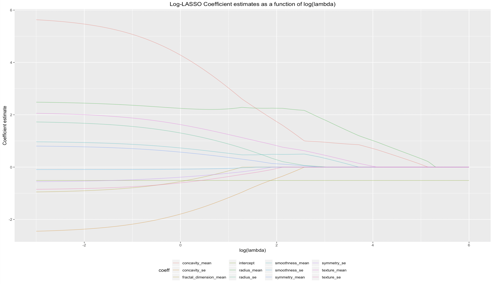
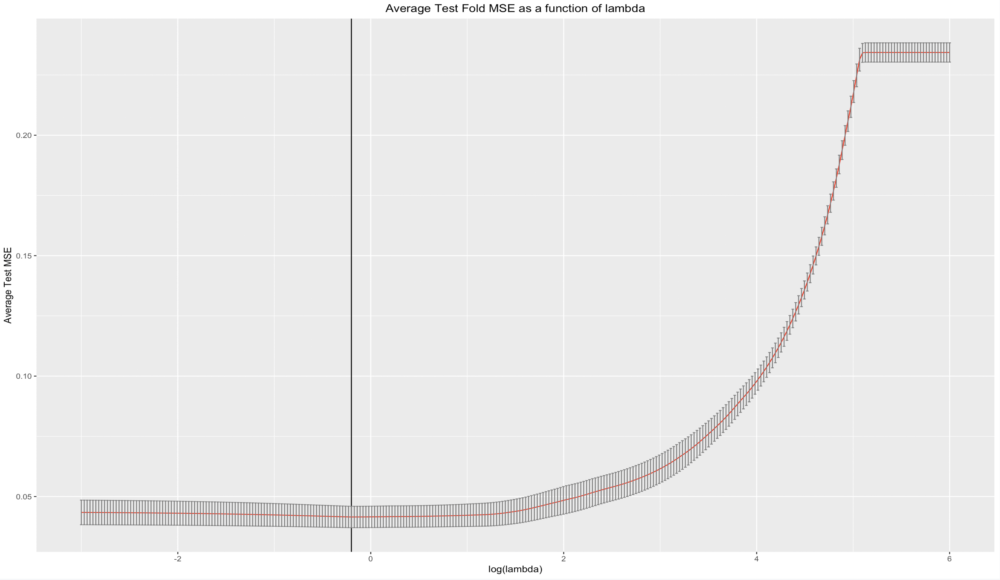
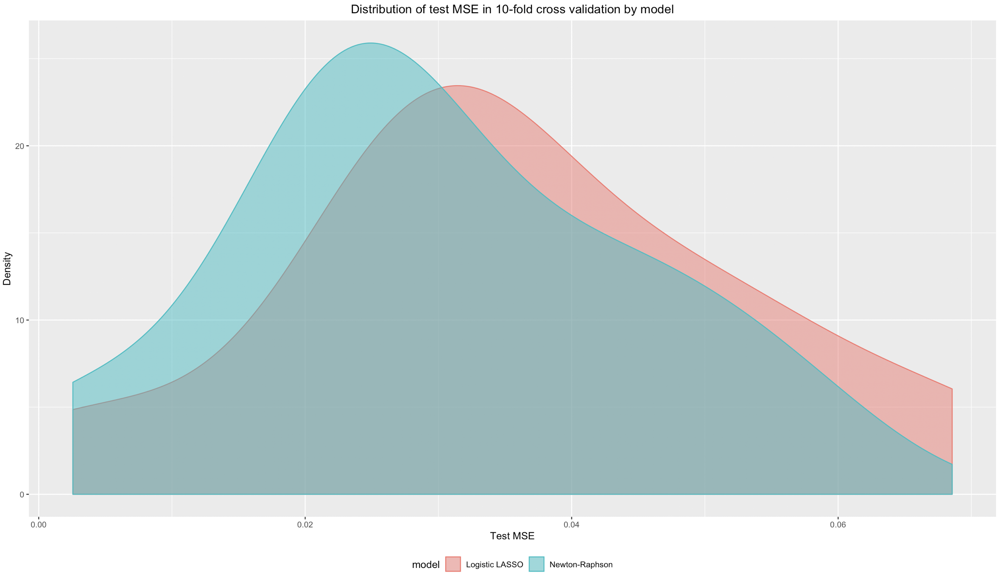

# P8160 Project 2: Optimization Study

## Introduction

The diagnosis of breast cancer at an early stage is an important goal of screening. While many different screening tests exist today, there is still room for improvement. A promising avenue for breast cancer detection is prediction based off of breast cancer tissue images. For example, a study by Kim et al. demonstrated that regression models could be helpful in diagnosing breast cancer using Logistic LASSO and stepwise logistic regression.

## The Models

The Newton-Raphson model incorporates the eponymous algorithm to optimize for a set of optimal beta coefficients. The Logistic LASSO incorporates a coordinate descent using the second-order Taylor approximation of the logistic log-likelihood. 

5-fold cross validation was used to find an optimal lambda penalization parameter, and 10-fold cross-validation was used to assess the predictive ability of both models. 

## Results

Both the Newton-Raphson and Logistic LASSO moedls successfully recreates the coefficients of `glmnet`. Below demonstrates how the coefficient estimates change as a function of increasing lambda.

The optimal lambda was found to be about 0.818, and the image below demonstrates the results of the 5-fold cross validation.

Overall, the two models have about the same predictive ability, but Newton-Raphson converges much faster than the Logistic-LASSO. 

## References

Kim, Sun Mi et al. Logistic LASSO regression for the diagnosis of breast cancer using clinical demographic data and the BI-RADS lexicon for ultrasonography Ultrasonography (Seoul, Korea) vol. 37,1 (2017): 36-42.